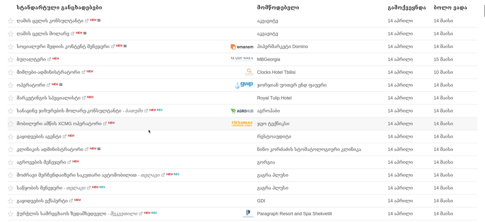
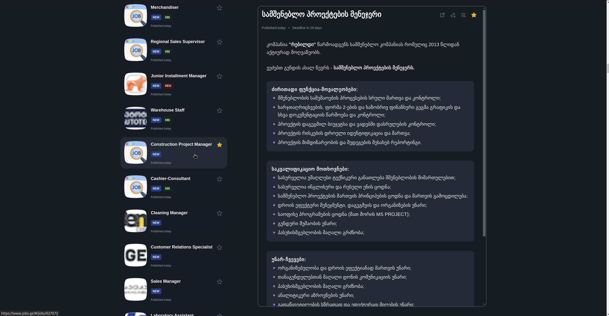

# Jobs.ge V2
#### A browser extension that provides a modernized interface for the Jobs.ge job board.

## Demo

### Screenshots

  

    
Before

    
  

  

    
After

    
  

### Videos

- [Jobs.ge before (without extension)](https://www.youtube.com/watch?v=DuJoZSjSkRk)
- [Jobs.ge after](https://www.youtube.com/watch?v=G0eptgR4EWw)

## Tech Stack

- WXT (Browser Extension Framework)
- Vue 3
- Vue Router
- Pinia
- TypeScript
- Tailwind CSS

## Credits

- <a href="https://www.flaticon.com/free-icons/job" title="job icons">Job icons created by Freepik - Flaticon</a>
- <a href="https://www.flaticon.com/free-icons/photo" title="photo icons">Photo icons created by Freepik - Flaticon</a>
- [Icons](https://icon-sets.iconify.design/tabler/page-12.html)
